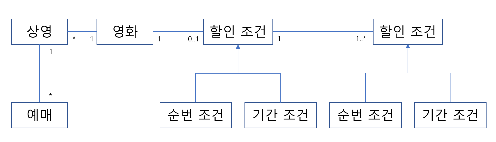
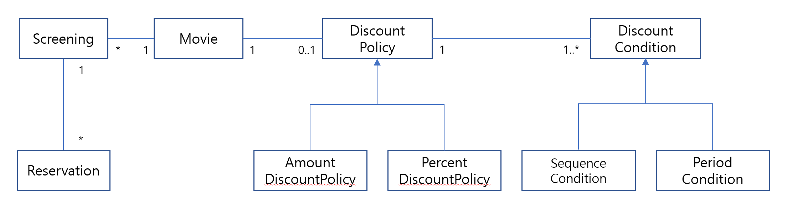
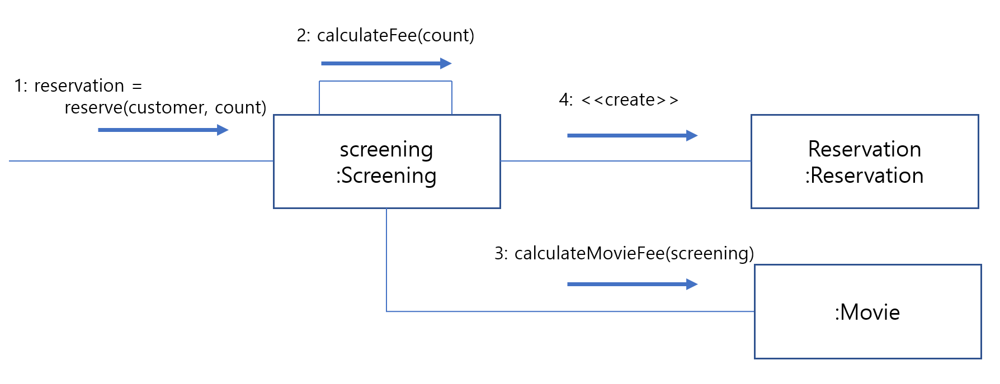
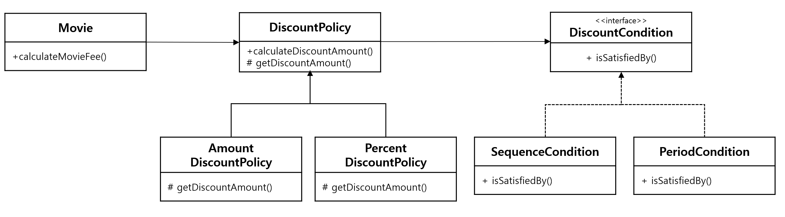

## 2장. 객체지향 프로그래밍

### 영화 예매 시스템

이번장에서 소개할 예제는 온라인 영화 예매 시스템이다.

#### 요구사항

앞으로의 설명을 위해 **'영화'** 와 **'상영'** 이라는 용어를 구분할 필요가 있다.

* **영화** : 영화에 대한 기본 정보를 표현
  * 제목, 상영시간, 가격 정보
* **상영** : 실제로 관객들이 영화를 관란하는 사건을 표현
  * 상영 일자, 시간 순번

할인액을 결정하는 두가지 규칙을 만족하는 예매자는 요금을 할인 받을 수 있다. 영화별로 **하나의 할인 정책만을 할당** 할 수 있으며 **할인 조건은 다수의 할인 조건을 함께 지정** 할 수 있으며, 순서 조건과 기간 조건을 섞는것도 가능하다.

* **할인 조건(discount condition)** :  가격의 할인 여부를 결정

  * 순서 조건(sequence condition) : 상영 순번을 이용해 할인 여부를 결정하는 규칙
  * 기간 조건(period condition) : 영화 상영 시작 시간(요일, 시작 시간, 종료 시간)을 이용해 할인 여부를 결정
* **할인 정책(discount policy)** :  할인 요금을 결정한다.

  * 금액 할인 정책(amount discount policy) : 예매 요금에서 일정 금액을 할인 해주는 방식
  * 비율 할인 정책(percent discount policy) : 정가에서 일정 비율의 요금을 할인 해주는 방식


| 영화                                           | 할인 정책                               | 할인 조건                                              |
| ---------------------------------------------- | --------------------------------------- | ------------------------------------------------------ |
| **아바타**<br />(가격: 10,000원)               | **금액 할인 정책**<br />(할인액: 800원) | **순번 조건**<br />조조 상영                           |
|                                                |                                         | **순번 조건**<br />10회 상영                           |
|                                                |                                         | **기간 조건**<br />월요일10:00 ~ 12:00 사이 상영 시작  |
|                                                |                                         | **기간 조건**<br />목요일 18:00 ~ 21:00 사이 상영 시작 |
| **타이타닉**<br />(가격: 11,000원)             | **비율 할인 정책**<br />(할인율: 10%)   | **기간 조건**<br />화요일 14:00 ~ 17:00 사이 상영 시작 |
|                                                |                                         | **순번 조건**<br />2회 상영                            |
|                                                |                                         | **기간 조건**<br />목요일 10:00 ~ 14:00 사이 상영 시작 |
| **스타워즈:깨어난 포스**<br />(가격: 10,000원) | 없음                                    | 없음                                                   |

### 객체지향 프로그래밍을 항해

#### 협력, 객체, 클래스

객체지향 프로그램을 작성할 때 가장 먼저 고려하는 것은 어떤 **클래스(class)** 가 필요한지 고민하고 클래스를 결정한 후 클래스에 어떤 속성과 메서드가 필요한지 고민한다.

하지만 이것은 객체지향의 본질과는 거리가 멀다. 진정한 객체지향 패러다임으로의 전환은 클래스가 아닌 객체에 초점을 맞출 때에만 얻을 수 있다.

* 어떤 클래스가 필요한지 고민하기 전에 어떤 객체들이 필요한지 고민하라. 클래스의 윤곽을 잡기 위해서는 **객체들이 어떤 상태와 행동을 가지는지**를 먼저 결정해야 한다. 객체를 중심에 두는 접근 방법은 설계를 단순하고 깔끔하게 만든다.

* 객체를 독립적인 존재가 아니다. 다른 객체에게 도움을 주거나 의존하면서 살아가는 협력적인 존재로 **객체를 협력하는 공동체의 일원으로 바라보는 것은 설계를 유연하고 확장 가능하게 만든다.** 객체들의 모양과 윤곽이 잡히면 공통된 특성과 상태를 가진 객체들을 타입으로 분류하고 이 타입을 기반으로 클래스를 구현하라.

#### 도메인의 구조를 따르는 프로그램 구조

소프트웨어는 사용자가 원하는 어떤 문제를 해결하기 위해 만들어진다. 문제를 해결하기 위해 사용자가 프로그램을 사용하는 분야를 **도메인** 이라고 부른다.

요구사항과 프로그램을 객체라는 동일한 관점에서 바라볼 수 있기 때문에 도메인을 구성하는 개념들이 프로그램의 객체와 클래스로 매끄럽게 연결이 가능하다.




일반적으로 클래스의 이름은 대응되는 도메인 개념의 이름과 동일하거나 적어도 유사하게 지어야 한다. 클래스 사이의 관계도 최대한 도메인 개념 사이에 맺어진 관계와 유사하게 만들어서 프로그램의 구조를 이해하고 예상하기 쉽게 만들어야 한다.

* **영화**  -> **Moive** 클래스
* **상영**  -> **Screening** 클래스

* **할인 정책**  -> **DiscountPolicy** 클래스
  * **금액 할인 정책**  -> **AmountDiscountPolicy** 클래스
  * **비율 할인 정책**  -> **PercentDiscountPolicy** 클래스

* **할인 조건** -> **DiscountCondition** 클래스
  * **순번 조건** -> **SequenceCondition** 클래스
  * **기간 조건** -> **PeriodCondition** 클래스



#### 클래스 구현하기

클래스를 구현하거나 다른 개발자에 의해 개발된 클래스를 사용할 때 가장 중요한 것은 어떤 부분을 외부에 공개하고 어떤 부분을 감출지를 결정하여 클래스의 경계를 구분 짓는 것이다. 클래스의 내부와 외부를 구분하는 이유는 경계의 명확성이 **객체의 자율성을 보장** 하기 때문이다.

* 자율적인 객체

  객체는 **상태(state)** 와 **행동(behavior)** 을 함께 가지는 복합적인 존재, 객체가 스스로 판단하고 행동하는 **자율적인 존재** 라는 것이다. 데이터와 기능을 객체 내부로 함께 묶는 것을 **캡슐화**라고 부른다.

  외부에서 접근을 통제 할 수 있는 **접근 제어(access control)** 매커니즘도 재공하는데 접근 제어를 위해 **public**, **protected**, **private**와 같은 **접근 수정자(access modifier)** 를 제공한다.

  캡슐화와 접근 제어는 객체를 두 부분으로 나눈다. **인터페이스와 구현의 분리(separation of interface and implementation)** 원칙은 훌륭한 객체지향 프로그램을 만들기 위한 핵심 원칙이다.

  * 외부에서 접근 가능한 **퍼블릭 인터페이스(public interface)**
  * 외부에서 접근 불가능하고 오직 내부에서만 접근 가능한 **구현(implementation)**

* 프로그래머의 자유

  프로그래머의 역할은 **클래스 작성자**와 **클라이언트 프로그래머**로 구분하는 것이 유용하다. 클래스 작성자는 클라이언트 프로그래머에게 필요한 부분만 공개하고 나머지는 꽁꽁 숨겨야 한다. 클라이언트 프로그래머가 숨겨 놓은 부분에 마음대로 접근할 수 없도록 방지함으로써 클라이언트 프로그래머에 대한 영향을 걱정하지 않고도 내부 구현을 마음대로 변경할 수 있다. 이를 **구현은닉(implementation hiding)** 이라 부른다.

#### 협력하는 객체들의 공동체



객체의 내부 상태는 외부에서 접근하지 못하도록 감춰야 한다. 대신 외부에 공개하는 퍼블릭 인터페이스를 통해 내부 상태에 접근할 수 있도록 허용한다. 객체가 다른 객체와 상호작용할 수 있는 유일한 방법은 **메시지를 전송** 하는 것 뿐이다. 다른 객체에게 요청이 도착할 때 해당 객체가 **메시지를 수신** 했다고 이야기 한다. 메시지를 수신한 객체는 스스로의 결정에 따라 자율적으로 메시지를 처리할 방법을 결정한다. 이처럼 수신된 메시지를 처리하기 위한 자신만의 방법을 **메서드(method)** 라고 부른다. 메시지와 메서드의 구분은 중요한데 메시지와 메서드의 구분에서부터 **다형성(polymorphism)** 의 개념 이 출발한다.

### 할인 요금 구하기

#### 할인 요금 계산을 위한 협력 시작하기

Movie 클래스의 calculateMovieFee() 메서드를 보자. 코드 어디에도 할인 정책을 판단하는 코드는 존재하지 않는다. 단지 discountPolicy에세 calcuateDiscountAmount 메시지를 전송할 뿐이다. 여기서 객체지향에서 중요하다고 여겨지는 두 가지 개념이 숨겨져 있다. 하나는 **상속(inheritance)** 이고 다른 하나는 **다형성** 이다. 그리고 그 기반에는 **추상화(abstraction)** 라는 원리가 숨겨져있다.

```c++
Money
Movie::calculateMovieFee(Screening& screening)
{
  return fee.minus(discountPolicy.calculateDiscountAmount(screening));
}
```

#### 할인 정책과 할인 조건

할인 정책은 금액 할인 정책과 비율 할인 정책으로 구분된다. DicountPolicy의 인스턴스는 생성할 필요가 없기 때문에 **추상 클래스(abstract class)** 로 구현하고 할인 조건을 만족하는 DiscountCondition이 하나라도 존재하는 경우 **추상 메서드(abstract method)** 인 getDiscountAmount 메서드를 호출해 할인 요금을 계산한다.

DicsountCondtion은 interface를 이용하여 선언되어 있다. 영화 할인 조건으로는 순번 조건과 기간 조건이 존재한다. 각각 SequenceCondition과 PeriodCondition이라는 클래스로 구현한다.



### 상속과 다형성

#### 컴파일 시간 의존성과 실행 시간 의존성

Movie는 DiscountPolicy와 연결되어 있으며, AmountDiscountPolicy와 PercentDIscountPolicy는 추상 클래스인 DiscountPolicy를 상속받는다. 이처럼 어떤 클래스가 다른 클래스에 접근할 수 있는 경로를 가지거나 해당 클래스의 객체의 메서드를 호출할 경우 두 클래스 사이에 의존성이 존재한다고 말한다.

Movie 클래스는 영화 요금을 계산하기 위해서 추상 클래스인 DiscountPolicy가 아니라 AmountDiscountPolicy와 PercentDiscountPolicy 인스턴스가 필요하다는 것이다. 하지만 코드 수준에서는 어떤 클래스에도 의존하지 않고 오직 추상 클래스인 DiscountPolicy에만 의존한다.

Movie의 인스턴스가 실행시점에 AmountDiscountPolicy나 PercentDisocuntPolicy의 인스턴스와 협력이 가능한 이유는 무엇일까?
> 해답은 Movie의 인스턴스를 생성하는 코드를 살펴봐야한다. Movie 생성자에서 DicountPolicy 타입의 객체를 인자로 받았을 것이다.

여기서 이야기 하고 싶은것은 **코드의 의존성과 실행 시점의 의존성이 서로 다를수 있다** 는 것이다. 하지만 코드의 의존성과 실행 시점의 의존성이 다르면 다를수록 코드를 이해하기 어렵지만 코드는 더 유연해지고 확장 가능해진다.

#### 상속과 인터페이스

상속이 가치 있는 이유는 부모 클래스가 제공하는 모든 인터페이스를 자식 클래스가 물려받을 수 있기 때문이다. 자식 클래스는 상속을 통해 부모 클래스의 인터페이스를 물려받기 때문에 부모 클래스 대신 사용될 수 있다.

Movie의 생성자에서 인자의 타입이 DiscountPolicy임에도 AmountDiscountPolicy와 PercentDiscountPoliy의 인스턴스를 전달할 수 있는 이유가 바로 이 때문이다. 이처럼 자식 클래스가 부모 클래스를 대신하는 것을 **업캐스팅(upcasting)** 이라고 부른다.

#### 다형성

메시지와 메서드는 다른 개념이다. Movie는 DiscountPolicy의 인스턴스에게 CalculateDiscountAmount 메시지를 전송한다. 그렇다면 실행되는 메서드는 무엇인가? Movie와 상호작용하기 위해 연결된 객체의 클래스가 무엇인가에 따라 달라진다.
다시말해서 Movie는 동일한 메시지를 전송하지만 실제로 어떤 메서드가 실행될 것인지는 메시지를 수신하는 객체의 클래스가 무엇이냐에 따라 달라진다. 이를 **다형성** 이라고 부른다.

다형성을 구현하는 방법은 매우 다양하지만 메시지에 응답하기 위해 실행될 메서드를 컴파일 시점이 아닌 실행 시점에 결정한다는 공통점이 있다. 메시지와 메서드를 실행 시점에 바인딩한다는 것이다. 이를 **지연 바인딩(lazy binding)** 또는 **동적 바인딩(dynamic binding)** 이라고 부른다. 이에 반해 전통적인 함수 호출처럼 컴파일 시점에 실행될 함수나 프로시저를 결정하는 것을 **초기 바인딩(early binding)** 또는 **정적 바인딩(static binding)** 이라고 부른다.

#### 인터페이스와 다형성

DiscountPolicy를 추상 클래스로 구현함으로써 자식 클래스들이 인터페이스와 내부 구현을 함꼐 상속받도록 만들었다. 그러나 종종 구현은 공유할 필요가 없고 순수하게 인터페이스만 공유하고 싶을 때가 있다. 이를 위해 C#과 자바에서는 **인터페이스** 라는 프로그래밍 요소를 제공하고 C++의 경우 **추상 기반 클래스(Abstract Base Class, ABC)** 를 통해 자바의 인터페이스 개념을 구현할 수 있다.
